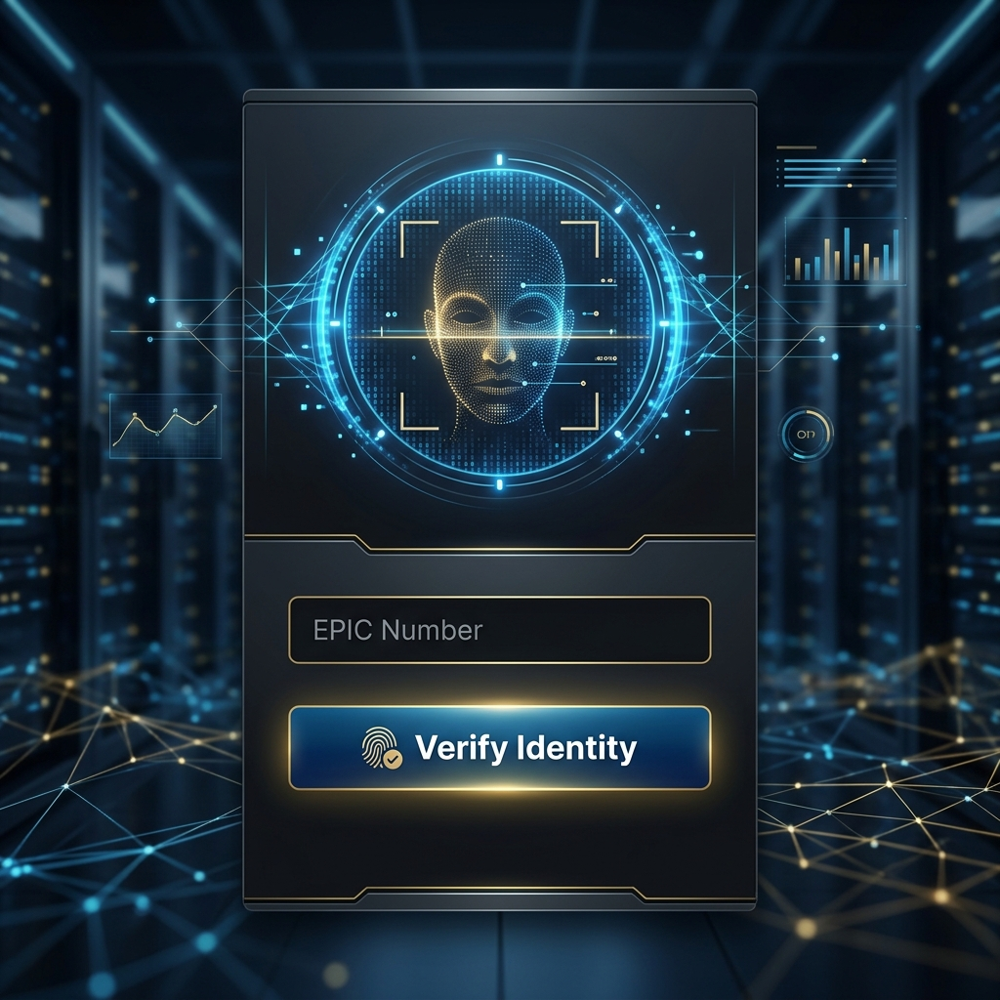
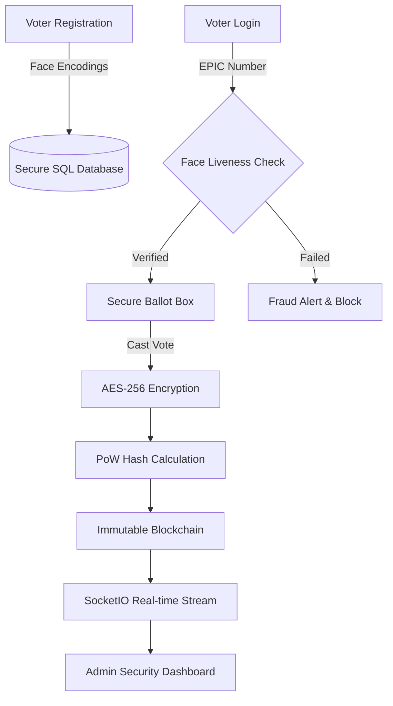

# 🇮🇳 Indian Voting System
### *Secure, AI-Powered, and Blockchain-Backed Voting Infrastructure*

[](https://python.org)
[](https://flask.palletsprojects.com/)
[](https://opencv.org)
[](#)
[](#)

---

## 📖 Overview
The **Indian Voting System** is a state-of-the-art electronic voting platform designed to eliminate electoral fraud and ensure absolute transparency. By integrating **AI-driven biometric verification** and an **immutable Blockchain ledger**, the system provides a tamper-proof environment for democratic elections.

### 🎥 Visual Preview
| Biometric Login Interface | Admin Analytics Dashboard |
| :---: | :---: |
|  |  |

---

## ✨ Key Features

### 1. 🔐 Cryptographic Blockchain Ledger
*   **Immutable Records:** Every vote is hashed using **SHA-256** and chained to the previous block.
*   **Proof-of-Work (PoW):** Prevents unauthorized modification of historical data.
*   **AES-256 Encryption:** Voter choices are encrypted at rest, ensuring complete anonymity.

### 2. 👁️ Biometric Authentication & Liveness Detection
*   **Deep Learning Verification:** Real-time facial encoding using Dlib/OpenCV.
*   **Anti-Spoofing:** Detects photos, videos, or masks to ensure the voter is physically present.
*   **Multi-Factor Auth:** Validates EPIC Number, Aadhaar status, and Biometrics in one flow.

### 3. 🛡️ Intelligent Fraud Detection (FraudEngine)
*   **Real-time Risk Scoring:** Monitors geolocation, session behavior, and device fingerprinting.
*   **Automatic Isolation:** Any session with a risk score > 50 is instantly flagged and blocked.
*   **CEO Alerts:** Immediate notification to the Election Commission for suspicious activities.

### 4. 📊 Live Turnout Analytics
*   **WebSocket Integration:** Real-time data streaming via **Flask-SocketIO**.
*   **Dynamic Visualizations:** Live demographic stats, turnout percentages, and regional heatmaps.

---

## 🏗️ System Architecture



---

## 🛠️ Technology Stack
*   **Backend:** Python 3.9+, Flask
*   **Database:** SQLite (SQLAlchemy ORM)
*   **AI/ML:** OpenCV, face_recognition, Dlib
*   **Security:** Cryptography (AES), Bcrypt, Hashlib
*   **Real-time:** Flask-SocketIO (WebSockets)
*   **Frontend:** HTML5, Tailwind CSS, JavaScript, Jinja2

---

## 📂 Project Structure
```text
├── app.py              # Main Application Entry
├── auth.py             # Authentication Logic
├── blockchain.py       # Blockchain Implementation
├── face_auth.py        # AI Biometric Engine
├── fraud_engine.py     # Fraud Detection Logic
├── encryption.py       # AES Security Utilities
├── models.py           # Database Schema
├── static/             # Assets (CSS, JS, Images)
├── templates/          # HTML Views
└── docs/               # Presentation Resources
```

---

## 🚀 Getting Started

### 1. Prerequisites
```bash
pip install flask flask-sqlalchemy flask-socketio cryptography bcrypt face_recognition opencv-python
```

### 2. Installation
1. Clone the repository
2. Run the initialization script:
   ```bash
   python init_db.py
   ```
3. Start the server:
   ```bash
   python run.py
   ```

### 3. Demo Credentials
*   **Admin Dashboard:** `admin` / `admin123`
*   **Test Voter EPIC:** `ABC1234567`
*   **Portal URL:** `http://localhost:8080`

---

## 🛡️ Security & Impact
- **Transparency:** Anyone can verify the blockchain integrity.
- **Accessibility:** Vote from any authorized biometric kiosk.
- **Integrity:** Zero tolerance for double voting or identity theft.

---
*Developed for the National Election Commission | © 2026*